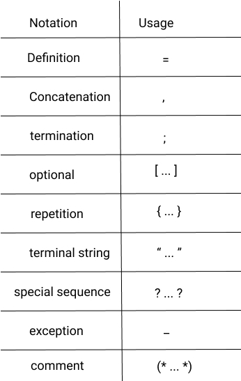

_This article will introduce you to context-free grammar, how it expresses a programming language specification in human readable form, and how GoLang 
presents complex language features with simple grammar constructs relative to the ECMA-262. This article will not teach you entire metasyntax but merely exposes you the idea of production rules._

If you have ever visited the [ECMAScript language specification](https://www.ecma-international.org) (aka. the JavaScript specification, or ECMA-262).
You probably wondered what the heck is going on if you're an average javascript developer like me 😄. It is an excellent resource for learning the
intricacies of how javascript works, but it's notoriously confusing for many javascript developers. Google and the ever so helpful stack overflow fail when you need them the most.
Reading the language specification lends itself well in such situations. In this article, we will talk broadly about context-free grammar and using EBNF to express it.
 
Having looked at goLang recently, I found myself in the [language specification docs](https://golang.org/ref/spec). I was ready to close the tab if met with a humongous blob of 
technical grammars written by seriously smart folks 💁🏾‍♂️. Well, no one wants to read about `Declarations and scope`, `Operands` and other language specs at midnight, right ?
Guess what; I read about those and more with ease, gathering a fair idea in a short time contrary to the ECMAScript specs. Go's simplicity is even evident in its specification documents.
How ? [**EBNF**](https://en.wikipedia.org/wiki/Extended_Backus%E2%80%93Naur_form). 


### What is EBNF
**EBNF** stands for **Extended Backus-Naur form**, a metasyntax notation for encoding grammars intended for human consumption. It is a non-strict superset of
[BNF](https://en.wikipedia.org/wiki/Backus%E2%80%93Naur_form). _For the pharmacist out there, no it is not the British National Formulary_. I digress.
**EBNF** expresses grammar as a series of terminal and non-terminal symbols that are link either by sequencing or choice. Think of terminal symbols as `alphabets`, and `punctuation marks`, 
whereas a phrase constitutes a non-terminal symbol which can be further broken down into terminal symbols.
Want to explore the world of production rules and context-free grammar ? [start here](https://en.wikipedia.org/wiki/Context-free_grammar).

Okay, enough theory, what does **EBNF** production rules look like ? Take this basic example 

```text
letter = "A" | "G" | "I" | "M" | "O" | "R" | "T";
delimiter = " "  | "🙃" 
character = letter | symbol
word = character | { character } 
```



Before explaining the seemingly gibberish up there, take a look at the table above I will wait.
 
Done ? The example is [groot's](https://unsplash.com/photos/K5TfhhrNs20) entire vocabulary 😅 expressed as productions.
And no, it's not a joke. From the table above, we know _=_ is a definition. The token to the left side of the definition must always be 
a non-terminal symbol. The right side a terminal, and or a sequence of non-terminal symbols.
 
Good, we are now equipped to read Groot's production rules. A _letter_ is defined as one of the terminal symbols "A" through "T". A _delimiter_ is defined as a terminal whitespace or a 
terminal poker face smiley. A _character_ is defined as a _letter_ or _delimiter_. A _word_ is defined as a character or repetition of characters. Simple, isn't it ? From the above 
production rules, Groot can say **I AM GROOT** with a poker face 🙃. Golang specification expresses language syntax by building up these linear production rules which are so easy to read !
Hiding complexity in meaningful terminal symbols and avoiding repetition.

### For Statement in EBNF

```text
ForStmt = "for" [ Condition | ForClause | RangeClause ] Block .
Condition = Expression .
```

A **for** statement executes a **block** of code until a **condition** is met. It takes three forms in goLang. For brevity sake I will not write out the production rules for the non-terminal
[Condition](https://golang.org/ref/spec#Condition), [ForClause](https://golang.org/ref/spec#ForClause) and [RangeClause](https://golang.org/ref/spec#RangeClause) at the right side of the definition.
The terminal symbols are representative of what you write in goLang code. Thus, "for" as a grammar in goLang is terminal.

For comparison, here is a **for** statement in the ECMAScript  specification. 

```text
IterationStatement:
    for(Expressionopt;Expressionopt;Expressionopt)Statement
    for(varVariableDeclarationList;Expressionopt;Expressionopt)Statement
    for(LexicalDeclarationExpressionopt;Expressionopt)Statement
``` 

The context-free grammar ECMA uses, arguably makes the language specification very difficult to read and unwelcoming to first-timers. But a short study of the notation will improve your edge on 
 on grasping the document. If you're interested in learning about the notational convention for the ECMAScript specification document 
[click here](https://www.ecma-international.org/ecma-262/10.0/index.html#sec-notational-conventions).

---

Well, there we go folks, learning about the context-free grammars prior to reading a language specification can better equip you to understand with relative ease. You should try it !
I hope you learnt a thing or two.


