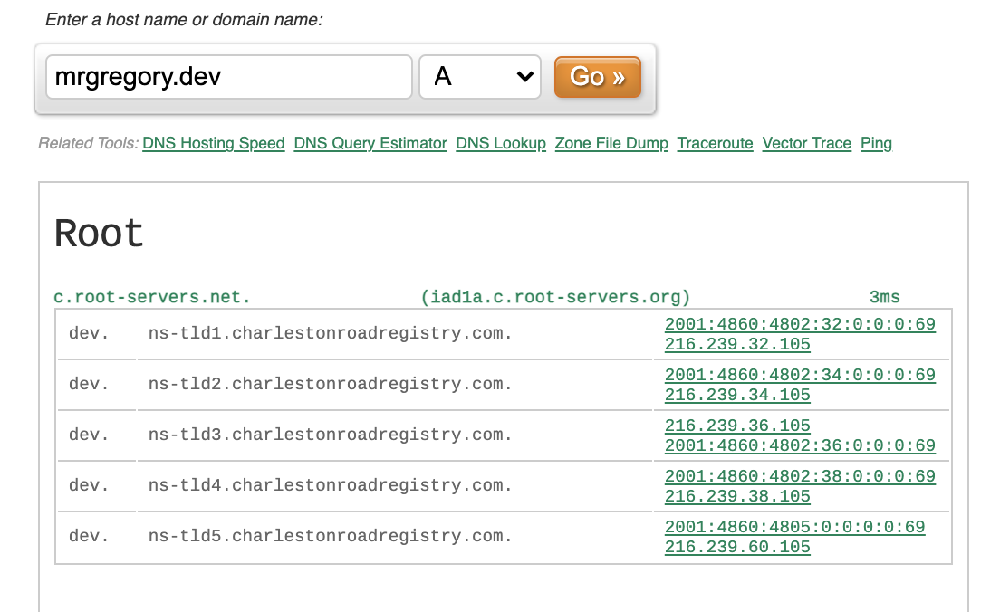
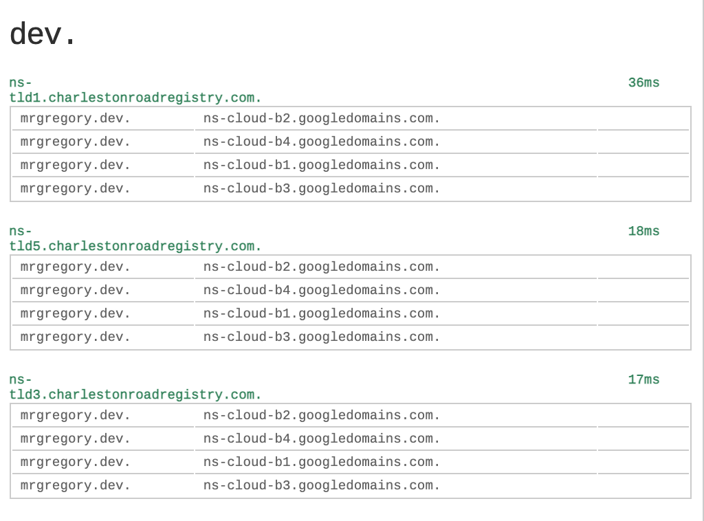
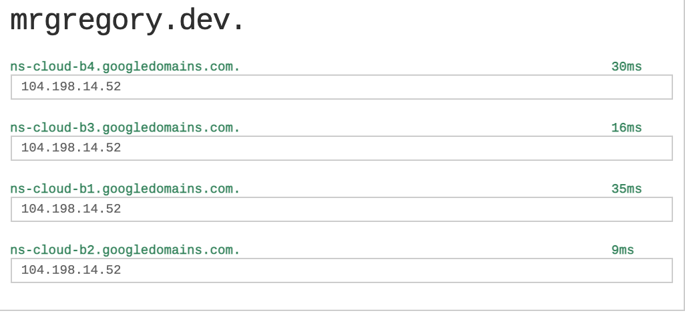

# Domain Name System (DNS)
Accessing web pages on the internet is easy. You simply type a domain name (google.com), and the page magically appears in your browser 😄. 
This is great for us, but not so much for your browser. It has to translate the domain name to an IP address in order to retrieve
the page over the internet. The middleman which translates domain names to IP addresses is called the DNS. 

The process of resolving URL to IP addresses is simple but to understand it we need to take a look at a number of things
[DNS Recursive Resolver](#DNS-Recursive-Resolver), [Root Name Servers](#Root-Name-Servers), [Top Level Domain Name Servers](#TLD-Name-Servers),
[Authoritative Name Servers](#Authoritative-Name-Server), [DNS Caching](#DNS-Caching), [DNS Queries](#DNS-Queries)

### DNS Recursive Resolver
This is also known as the DNS recursor. It receives queries from applications such as your web browser and operating system and is responsible for either
resolving the query from its own caches or making additional requests to other DNS servers in the DNS hierarchy. 
It starts the DNS lookup process if there is no record in its cache. 

### Root Name Servers
Root name servers as the name suggests is at the root of the Domain Name System hierarchy. Root name servers store and maintains in its database, information 
that allows it to point to more specific locations like the generic top-level domains (com, .org, .net, .edu),
country code top-level domains (.us, .uk) and [Internationalized Domain Name](https://www.icann.org/resources/pages/idn-2012-02-25-en) which is quite uncommon.
It is the first step in translating human-readable URLs to IP addresses.
Root servers fulfil requests by responding with a list of name server details of [TLD Name Servers](#TLD-Name-Servers), the most suitable for the domain name requested by
looking at the url extension.

There are 13 well-known IP addresses for the root servers but under
these 13 are 100s of servers which resolve client queries. Look at root servers, operator, locations and their IP addresses [here](https://root-servers.org/).

### TLD Name Servers
The role of a TLD name server is simple but very important. It holds information about domain names with the same extension. 
Examples are `.com`, `.net` TLD name servers. Root name servers redirect a DNS recursor here based on the domain name extension.
A TLD server responds with a list of authoritative name servers for the requested domain. For my website `mrgregory.dev`, here are examples of authoritative name servers from some **.dev** TLD servers

### Authoritative Name Servers
This is at the bottom of the hierarchy, and is often the last step in DNS' quest to resolve a domain to an IP address.
Here is where information about the domain name is found and returned to the DNS recursor. Depending on whether the domain name has 
an alias (CNAME record), an authoritative server responds to the DNS recursive resolver with the CNAME record containing an alias domain which triggers another DNS lookup.
If not, an A record containing an IP address is returned to the recursor. Note in the image below, we have an IP address from the list authoritative name servers provided by the TLD
name server.

### DNS Caching 
Caching is an important part of DNS resolution. DNS is fast ⏩ but caching makes it even faster ⏩⏩. Caching happens in several places in a typical DNS lookup. 
Operating Systems cache DNS records, web browsers, DNS Recursive Resolvers, and at each step during a DNS lookup. Records are cached with a TTL (time to live).
When the TTL expires, the record is removed. This allows your browser or OS to quickly retrieve records of previously looked up domain names without having to do
a complete DNS lookup process.

### DNS Queries
I will keep this section brief. One or more of these types of queries are used to keep DNS lookups optimised. **Recursive Query**, **Non-Recursive Query** or 
**Iterative Query** are the types we need to know. __Recursive queries__ are made to recursive name servers and __iterative or non-recursive queries__ are made to iterative
name servers. Root name servers, TLD servers and authoritative name servers are iterative by nature. For recursive queries, each server in the chain does a request by itself to another server in an
attempt to resolve the query. For iterative queries, each server responds to the DNS client (DNS Recursor) with a list of servers that could potentially resolve the query, the recursor then 
follows up with a new request to the server(s).

### Fun resources 
[Ultra tools](https://www.ultratools.com/dnsTools) provides lots of cool tools to visualize DNS lookups and more. Check it out ! Until next time 👋🏽

