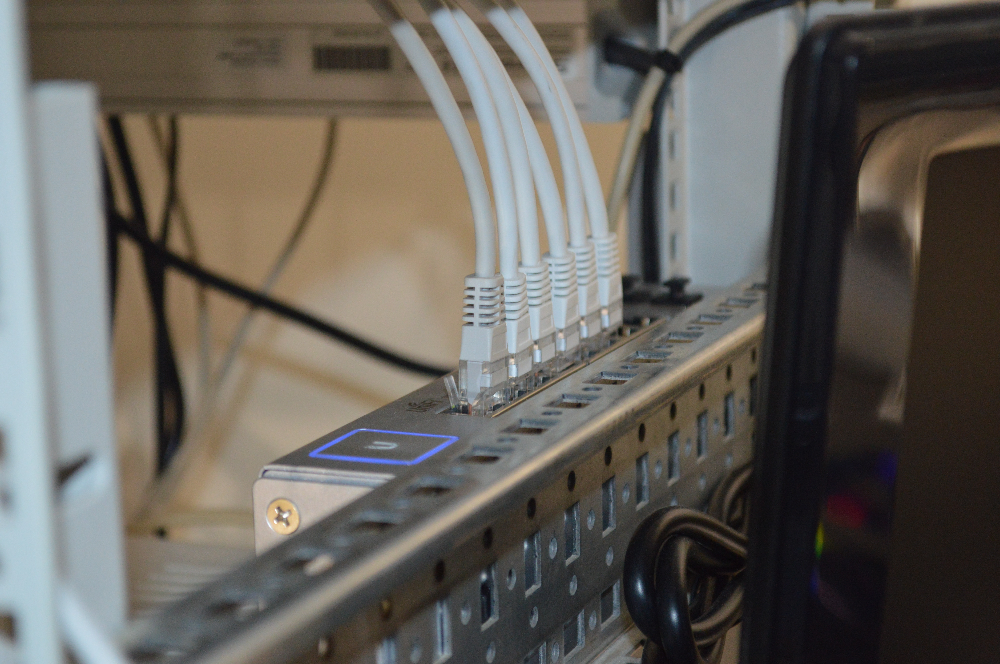
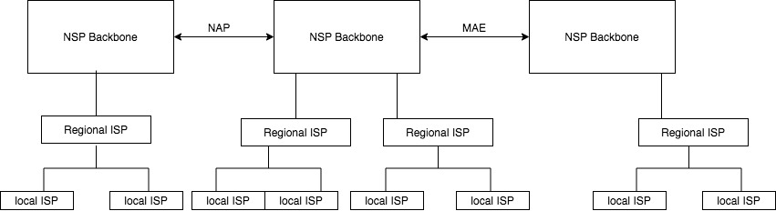

_This article is a comprehensive guide on the different components that makes up the internet._

The internet, the one thing we use daily but haven't really taken the time to understand it, even at a high level.
This article highlights the most important components of the internet. I found that, it is easier to piece them together once you have
an idea what they all are. Let's begin.

### Internet Address
Here is a good place to start, the moment you connect a device to the internet, it is assigned a unique address often called IP address. 
It is a numerical label for devices on a network that uses the internet Protocol. There are two versions as of now IPv4 and IPv6.

IPv4 is represented by a 32-bit number, written in a dot-decimal notation like so nnn.nnn.nnn.nnn.
An example is 104.198.14.52 which is 1757810228 when expressed as a 32 bits integer (it is quite simple to [convert IPv4 addresses to 32 bits integers](http://www.aboutmyip.com/AboutMyXApp/IP2Integer.jsp)).
 It is predominantly used on the internet and chances are you have seen it at least once before 😄.  

IPv6 is the next version of internet addresses defined by the Internet Protocol and is represented using 128 bits 
(eg 2a01:4b00:f807:ef00:ccd3:b569:e5d5:508e).

IP addresses have two main parts, **network prefix** and **host identifier**. Network prefix identifies the network a 
host belongs to and the host identifier, well it identifies the host 😄. A subnet mask is used to divide an internet address into
a network and host identifier. Example, 192.0.2.1/24 is a CIDR notation for an IP address and its subnet mask. Simply put, first 24 bits
represents the network and subnet and the rest identifies the host. 

### Protocol Stack
Okay, so you are connected to the internet and have a unique IP address. You are ready to send and receive some form of data across the internet.
This is achieved using the **protocol stack**. Every device needs one to communicate over the internet, 
it is usually built into the operating system of the device you're using. The protocol stack used on the internet is the **TCP/IP**
 
### TCP/IP protocol stack.
As mentioned before, this is the protocol stack used on the internet to transform outgoing data from text to electronic signals and vice versa.
**TCP/IP** is made of two major communication protocols (TCP and IP). TCP/IP protocol stack specifies how data is broken into 
manageable chunks(packets), addressed, transmitted, routed and received by the destination host reliably or not (I will explain 😀) .
TCP/IP is made of 4 layers. **Application protocol layer**, **Transport Layer**, **Network Layer** and the **hardware or physical layer**.
 
#### Application protocol layer

Examples of application layer protocols are File Transfer Protocol(FTP), Simple Mail Transfer Protocol(SMTP), 
Hypertext Transfer Protocol Secure(HTTPS), TELNET and DNS. This is the first protocol in the stack. Most of what the user closely
interacts with is at this layer. 
If you fired up your favourite browser (chrome) and visited a webpage, it would use HTTP or HTTPS, which are both part of the WWW application type.
 

#### Transport Layer
The two main transport protocols are Transmission Control Protocol (TCP) and User Datagram Protocol (UDP). 
 
They work in conjunction with the Internet protocol layer and breaks messages into smaller manageable chunks called packets/datagram,
addresses, and routes packets to and from applications via port numbers.

TCP is reliable and solves many problems regarding packets loss, corruption etc by using an error-checked delivery mechanism. It is also
[connection-oriented](https://en.wikipedia.org/wiki/Transmission_Control_Protocol#Connection_establishment) thus a connection is established
through a three-way handshake process.  
 
[User Datagram Protocol](https://en.wikipedia.org/wiki/User_Datagram_Protocol) is connectionless and sometimes used instead of TCP. 
It offers a low-latency packet(datagram) transfer but isn't reliable (no error-checked delivery mechanism, no guarantee of delivery and no
correction is attempted when datagram is corrupted unlike TCP). No connection is establish prior to communication with destination host. 

#### Network Layer (Internet Layer)
At a high level, this layer is simple yet probably the most important. It addresses packets and delivers them to a destination host using the IP
address in the packet headers thus enabling **Internetworking**. The network layer protocols are __Internet Protocol__ and __Internet Control Message Protocol (ICMP)__. 
Internet protocol layer provides identification and a location system for devices on a network and routes packets across the internet.
Internet Control Message Protocol is used for error reporting by network devices.

#### Hardware Layer
This is the lowest layer in the stack. Its role is more with the physical transmission of raw bits. Here, packets are converted to electronic signals or converted from network signals to packets.
Network cards and modems etc are examples in this layer. 

### Internet Infrastructure
So your data left your device, travels through a public telephone network, your ISP's local equipments (Modem Pools and ISP port servers), several routers and onto the ISP backbone and now out in the wild.
Okay, it is more complicated than that, but you get the idea. The internet backbone consists of large network providers called **Network Service Providers**. A few examples are IBM, AT&T and Verizon. 
These larger networks supply backbone access to regional and local ISPs to which everyone else connects to. NSPs essentially provide the infrastructures that makes the internet.
NSPs communicate with each other via **Network Access Points (NAP)** or **Metropolitan Area Exchanges(MAE)** which are similar to NAP but privately owned. Here is an overly simplified diagram of the internet infrastructure.

---

😄 Okay folks, this is merely a reference material, a very high level explanation. If you're interested, take the different components
explained here read more about them. The network and application layers are definitely interesting ones 😉. Until next time, stay curios.

