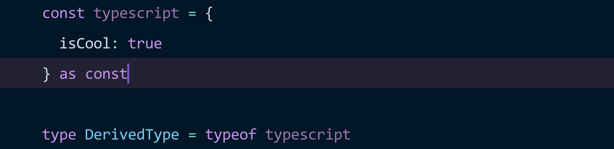
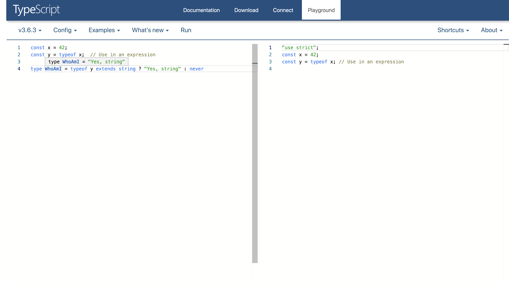
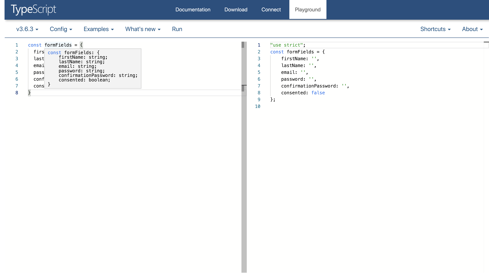
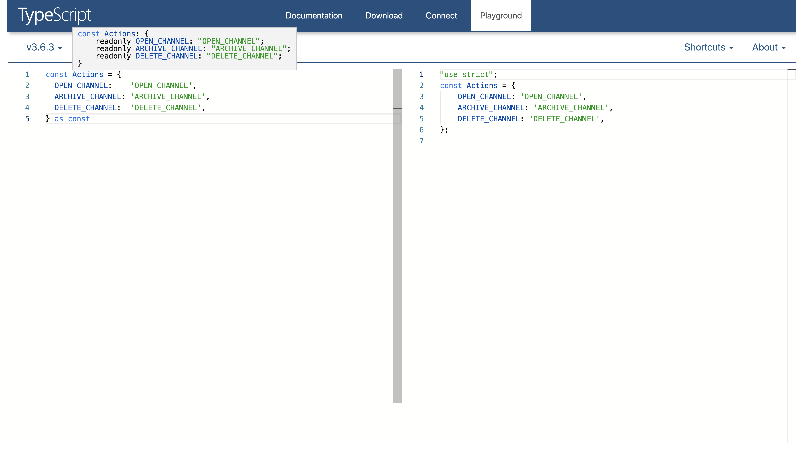

_This article will introduce you to typescript's **keyof**, **typeof** keywords and the **const** assertion type.
How to use these operators in day to day programming with typescript._

Typescript provides a great set of [utility types](https://www.typescriptlang.org/docs/handbook/utility-types.html), 
operators and keywords that makes the lives of developers easier ✅. 
In this article, we will take a look at and understand the `typeof` operator, index type query operator `keyof`,
`const` assertions and how to capture types from plain javascript literal values.

### keyof operator

The `keyof` keyword is an indexed type query operator. It yields a union containing the possible property names/keys of its operand.
Most of the time, `keyof` precedes object literal types, especially user-defined types. It can be used against primitive types, however not very useful.

**Syntax**
```typescript
keyof P
P = Type
```

An indexed type query of type `P` or `keyof P` produces a union of property names for type T. 
It is good to know how all [types](https://github.com/Microsoft/TypeScript/blob/master/doc/spec.md#3-types) 
behave and the yielded union when queried. Let's take a peek at it, to avoid any surprises.

```typescript
// Predefined Types
type KeyofAny = keyof any; // string | number | symbol 🤔

// You don't see these everyday 😬
type KeyofBoolean = keyof boolean; // "valueOf"
type KeyofString = keyof string; //  number | "charAt" |  ...Union of Object.getOwnPropertyNames(String.prototype)
type KeyofNumber = keyof number; //  "toFixed" |  ...Union of Object.getOwnPropertyNames(Number.prototype)
type KeyofSymbol = keyof symbol; // "toString" |  "valueOf"
type KeyofVoid = keyof void; // never
type KeyofNull = keyof null; // never
type KeyofUndefined = keyof undefined; // never

//Enums
enum Preference {
  TYPESCRIPT,
  JAVASCRIPT,
}
type KeyofEnum = keyof Preference; // "toString" | "toFixed" ...Object.getOwnPropertyNames(Number.prototype)

// String literal type
type KeyofString = keyof 'Literal'; // Same as string. String literal types are subtypes of String primitive types.

// Array literal type
type KeyofArray = keyof []; // number | Union of Object.getOwnPropertyNames(Array.prototype)

//Tuple literal type
type KeyofTuple = keyof [number, number]; // number | number | Union of Object.getOwnPropertyNames(Array.prototype)

// Very important 🔥🔥!!

// object literal type
interface Rectangle {
  type: 'Quadrilateral';
  length: number;
  width: number;
}

type keyofInterface = keyof Rectangle; // 'type' | 'length' | 'width'
```

We will be focusing on the more useful [object types](https://github.com/Microsoft/TypeScript/blob/master/doc/spec.md#33-object-types) from here on.
The [typescript playground](https://github.com/Microsoft/TypeScript/blob/master/doc/spec.md#3-types) is a great way to try these for yourself.

**Usages**
<br />
Correct use of `keyof` can reduce repetitive type definitions and make for elegant type definitions 🌹. 
If you're familiar with typescript's utility types, you would have come across [`Omit`](https://www.typescriptlang.org/docs/handbook/utility-types.html#omit). We won't discuss what it does. But here is the definition from `lib.es5.d.ts`;

```typescript
type Omit<T, K extends keyof any> = Pick<T, Exclude<keyof T, K>>;
```

`keyof any` ? not shocking, is it? Now that we know the indexed type query of the predefined types 🙌🏽.
The expanded form of this expression `keyof any` is not hideously verbose, but you can just about see the elegance.

```typescript
type Omit<T, K extends string | number | symbol> = Pick<T, Exclude<keyof T, K>>;
```

We have a glimpse of elegant `keyof` usage, let's talk about more practical use cases, shall we?

_Typescript's static compile-time type system closely models the dynamic run-time type system of JavaScript_. For this reason, user-defined types are "_malleable_".
It is common to take an existing type and make its properties optional and vice versa, create a subtype etc.

Below is a hypothetical function that inspects an [axios](https://github.com/axios/axios) request and returns a boolean for matched paths.

```typescript
import { AxiosRequestConfig } from 'axios';

function isMatch(requestConfig: AxiosRequestConfig, path: string): boolean {
  // object requestConfig.url is possibly undefined
  return requestConfig.url.endsWith(path); //Ops
}

isMatch({}, '/users'); // Why is this okay axios :(
```

Okay, let's make sure our teammates provide a "valid" request configuration by reconstructing AxiosRequestConfig ! We want to keep everything but `url`.

```typescript
import { AxiosRequestConfig } from 'axios';

// we obtain all permitted property names with `keyof` and exclude the url property name
type ConfigKeys = Exclude<keyof AxiosRequestConfig, 'url'>; // Great url is gone

// lets reconstruct now 🔨
type CustomRequestConfiguration = {
  url: string;
} & { [property in ConfigKeys]: AxiosRequestConfig[property] };

function isMatch(
  requestConfig: CustomRequestConfiguration,
  path: string,
): boolean {
  return requestConfig.url.endsWith(path); // Everyone is happy
}

isMatch({}, '/users'); // No !
isMatch({ url: 'https://mrgregory.dev/users' }, '/users'); // Okay we are friends now !
```

Imagine having to type all the other property names and respective values to make this possible, **keyof** to the rescue.

If you are unfamiliar with `&`, it is called the [intersection type](https://github.com/Microsoft/TypeScript/blob/master/doc/spec.md#35-intersection-types) operator, say `object.assign()` 😄.
`AxiosRequestConfig[property]` spooky ey ? This is call [indexed access or lookup types](https://www.typescriptlang.org/docs/handbook/release-notes/typescript-2-1.html#example-1),
similar to querying an object literal, it returns the property value. We will dissect this further down. Stay put.

**Let's look at another example.**
<br />
Take this hypothetical register form with a "tonne" of fields. We are required to validate and track errors for each field!
Equipped with `keyof`;

```typescript
interface FormFields {
  firstName: string;
  lastName: string;
  email: string;
  password: string;
  birthDay: string;
  birthMonth: string;
  birthYear: string;
  consented: boolean;
  confirmationPassword: string;
}

// Create a union of string literal types
type FieldNames = keyof FormFields; // "firstName" | "lastName" .... | "consented"

type FieldErrors = { [field in FieldNames]: boolean }; // { firstName: boolean; lastName: boolean; .... consented: boolean; }
```

Elegant, isn't it? We do not have to maintain separate explicit types for `formFields` and `FieldErrors`. Great first step!

**Another example**
<br />
Very recently I learnt about the power of `JSON.stringify` replacer function.
Let's create a type-safe half baked `JSON.stringify` that accepts an object with a very specific shape, whose values are only primitives 😄 to keep it simple.

```typescript
declare function stringify<Input extends object>(
  source: Input,
  replacer?: (
    key: keyof Input,
    value: Input[keyof Input],
  ) => string | boolean | number,
  spacer?: string | number,
): string;

interface Person {
  name: string;
  age: number;
  beard: boolean;
}

const pawel: Person = { name: 'Pawel', age: 1, beard: true };

// ok
stringify(pawel, (key, value) => (key === 'age' ? 23 : value));

// ops Error, this condition will always return 'false'
// since the types '"name" | "age" | "beard"' and '"height"' have no overlap.
stringify(pawel, (key, value) => (key === 'height' ? 23 : value));

// Error {} is not assignable to `string | number | boolean`
stringify(pawel, (key, value) => (key === 'age' ? {} : value));
```

Here, we see the indexed access query in use to make sure `value` is one of the user-defined property value types. Let's shine some light on how `keyof` works in lookup types.

```typescript
interface Person {
  name: string;
  age: number;
  beard: boolean;
}

type Values = Person[keyof Person]; // string | number | boolean

// How ?
// Person[keyof Person] =
//        Person["name" | "age" | "beard" ] =
//            Person["name"] | Person["age"] | Person["beard"] = string | boolean | number;
```

We will see a few more use cases of `keyof` in the next section while we discuss `typeof`

### Typeof operator
The typeof keyword can be used as an expression or in a type query. When used in an expression, 
the type of the expression will be a string thus the string primitive type of the evaluation of the expression.
The dual and more useful of this is `type querying` with `typeof` which we will see a bit later.

```typescript
const x = 42;
const y = typeof x; // Use in an expression
```

'x' in the example above has the type 'number' and 'y' has an implicit type 'string'. Read this as `y is the typeof (typeof x)` and you see the light 💡 😄.



Here we validate if `y` is indeed of type `string` obtained from the expression `typeof x`, which evaluates to a string primitive type `"number"`. Got it?

**Javascript's typeof Operator** <br/>

```typescript
typeof undefined; // "undefined"
typeof true; // "boolean"
typeof 1337; // "number"
typeof 'foo'; // "string"
typeof {}; // "object"
typeof Number.parseInt; // "function"
typeof Symbol(); // "symbol"
```

**Typescript's typeof Operator** <br/>
`typeof` operator shines more when used as a `type query operator`. You can query literal values for type or shape.
 
 Let's go back to our register form example. We defined an object literal type via the interface `FormFields`, but we can take this a step further.
 Later down the line, we would have had to define an object literal to hold the default values for our hypothetical form.

```typescript
interface FormFields {
  firstName: string;
  lastName: string;
  email: string;
  password: string;
  birthDay: string;
  birthMonth: string;
  birthYear: string;
  consented: boolean;
  confirmationPassword: string;
}

type FieldNames = keyof FormFields;

type FieldErrors = { [field in FieldNames]: boolean };

const defaultFormFieldValues: FormFields = {
  firstName: '',
  lastName: '',
  //....
}

const defaultFieldErrors = { //.... }
```

What we have done here is introduced more maintenance work. If I added a new field to our form, I'd have to remember to update
all defined types and interfaces ☹️. Let's do better with `type querying`.

```typescript
const formFields = {
  firstName: '',
  lastName: '',
  email: '',
  password: '',
  confirmationPassword: '',
  consented: false,
};

type FormFields = typeof formFields; // { firstName: string; lastName: string; ... consented: boolean}
type FieldErrors = Record<keyof FormFields, boolean>; // { firstName: boolean; ... consented: boolean}

declare function useState<T>(defaultState: T);

function RegisterForm() {
  const [formFields, setFormFields] = useState<FormFields>(formFields);
  //...
}
```

[`Record<K, T>` see meaning](https://www.typescriptlang.org/docs/handbook/utility-types.html#recordkt)

The captured types are [widened](https://github.com/Microsoft/TypeScript/blob/master/doc/spec.md#312-widened-types) and can be used just like any user-defined `interface` or `type`.
`Note: Most of the time, typescript will infer the types of javascript literals. The inferred type is widened`.



Another common place you will find this operator is in [mapped types](https://www.typescriptlang.org/docs/handbook/release-notes/typescript-2-1.html#mapped-types),
especially useful for type transformations. Let's make our form field type have only readonly properties !

```typescript
const formFields = {
  firstName: '',
  lastName: '',
  email: '',
  password: '',
  confirmationPassword: '',
  consented: false,
};

type LooseFormFields = typeof formFields;

type FormFields = {
  readonly [property in keyof LooseFormFields]: LooseFormFields[property]
}; // { readonly firstName: string ... }
```

Typescript provides a built-in utility for this purpose called `Readonly`.

```typescript
declare let formFields;

type FormFields = Readonly<typeof formFields>;
```

### Capturing literal type with `const` assertions

TypeScript 3.4 introduces a new postfix operator for literal values called `const assertions`. In summary, it prevents literal type widening,
makes object and array literal properties become `readonly`. These characteristics make it ideal for capturing and narrowing types.

We will focus more on the use of const assertions with object literal types. If you want to capture a literal primitives types use a `const` declaration.

```typescript
// typeof a is the literal type 42 and cannot be widened.
const a = 42;

// This is quite redundant as it is indicative that b cannot be reassigned and or widened ❌
// This is not idiomatic javascript
// for semantic clarity use a const declaration
let b = 'Hello' as const;
b = 'Hi'; // Nope
```

With object literals;



`const` assertions are perhaps most useful for creating narrowed and enum-like literal types. The example below demonstrates these.

```typescript
declare let fs: any;

const flags =  [
  {action: 'delete', files: [ 'Pedro.txt', 'Sharkey.txt' ] },
  {action: 'create', file: 'Dan.txt' },
]as const;

for (const flag of flags) {
  if(flag.action === 'create') {
      // sweet sweet narrowing
      fs.writeFileSync(flag.file)
      fs.writeFileSync(flag.files) // Error
   }
  }
}
```

**enum-like constructs**

```typescript
const NOTIFICATIONPREFERENCE = {
  email: 'EMAIL',
  text: 'TEXT',
  both: 'BOTH'
} as const

NOTIFICATIONPREFERENCE.email // ok
NOTIFICATIONPREFERENCE.test // ❌
// Property 'test' does not exist on type '{ readonly email: "EMAIL"; readonly text: "TEXT"; readonly both: "BOTH"; }'.
// Did you mean 'text' ? ✅ 
```

Beautiful, isn't it?

---

If you made it to this point, you would have had an idea how to use `keyof typeof and const assertions` in your day to day programming
with typescript. If you know something that wasn't mentioned in this article, I'd love to know them too. Please share in the comment section below!
Until next time, stay curious!
