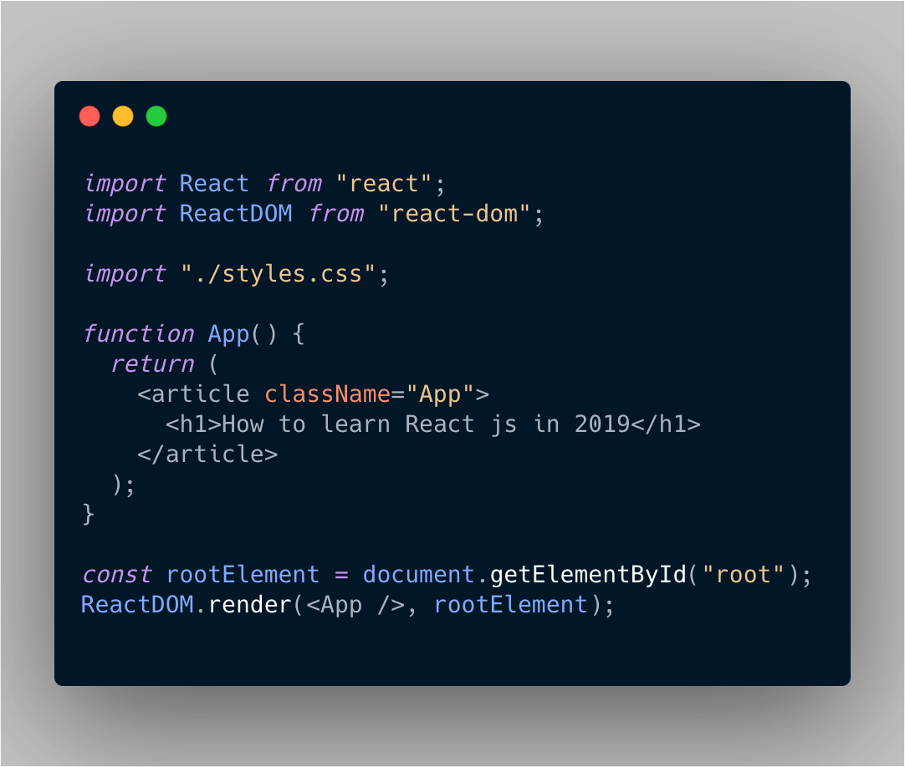

### Why should I learn React?
Web development has rapidly "evolved" over the years, the complexity of user interfaces and interactions along with it. 
Interestingly, there has been a surge in developer tools to meet the requirements and challenges presented by the "today's 
web application".
 
Meet [**Reactjs**](https://reactjs.org/), one of many javascript libraries for building user interfaces.
It allows you to build isolated views for states **in** your application, which update and renders when data changes. 
This declarative nature of building applications makes behaviour predictable and bugs easier to find.
React is platform independent thus you learn once and write everywhere. React can render on servers using node.js, mobile devices 
with [React-native](https://facebook.github.io/react-native/), desktop applications with electron etc. React has a component based architecture 
that help you write encapsulated components(views), decoupled and each managing its own state. 
  
As of writing this article, Reactjs has over [138k stargzers](https://github.com/facebook/react/stargazers) on
github thus used by several developers and organisations (Facebook, Instagram, Netflix, [Mindera](https://mindera.com/)
etc). It was kick-started by facebook and currently has over 1.3k contributors maintaining the library and has a great community support.

### What are the requirements to learn React.js?
We strongly advice a good foundation in the core web and markup languages prior to learning any related framework or library. React is no exception.
React uses JSX, a syntax extension to JavaScript that closely resembles HTML. CSS is typically used to style applications and of course javascript for 
adding behaviour. You will utilise important language features, constructs and methodologies while developing react applications henceforth these requirements.  

### Can you learn React.js fast?
**Short answer YES**  
React is a relatively small library or at least started as such. It has a few [core concepts](https://reactjs.org/docs/hello-world.html) 
that needs to be understood prior to building applications with it. Twelve to be precise. To give you an idea, if you learnt 2 concepts everyday, 
It would take 6 days 😄. As with any library or framework, React has some advance topics, patterns that are worth looking into as well. They will enable you to solve
problems elegantly and further enhance user experience.

### Should I learn React or JavaScript first?
React is built with javascript. It uses core javascript language features and concepts and hence is imperative to understand it before tackling React.
This is applicable to any other framework or library.

### Should I learn React.js before learning React Native?
React adheres to the learn once, write anywhere policy thus is platform independent. The platform you learn React is not very important.
Choose a platform and code away. Comfortable with mobile development ? Try learning react with react-native, otherwise the web is a great place to start.
The concepts remain unchanged, only the [renderer](http://iamdustan.com/react-renderers/) does ⚛️.   

### Where should I start? (guide to how to start learning)
The docs is a great place to start. It is concise and teaches you everything you need to know. There is also myriad of video course to choose from.
We recommend learning by doing. Following library authors and "community leaders" is a great way to keep upto date with emerging patterns and conventions.

Good luck. 
